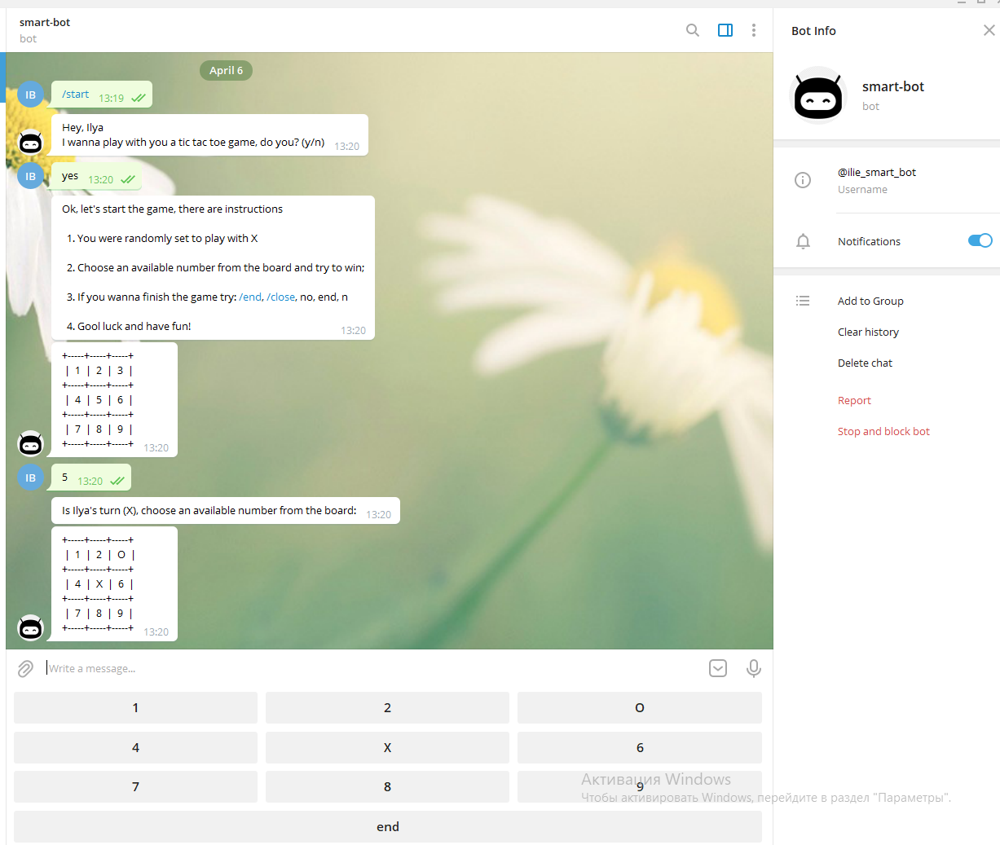
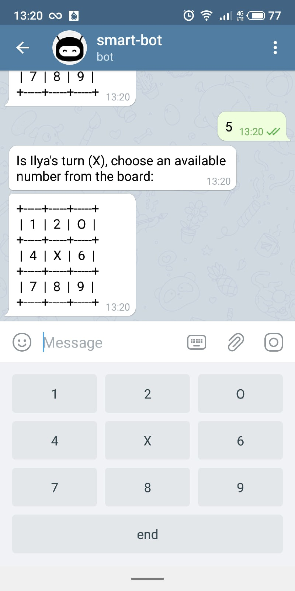

# Ruby Telegram Bot

I did this project for learning purposes as a capstone project from Microverse after completing the Ruby curriculum.
Ut us a Telegram bot for playing the Tic-Tac-Toe game.

## Description

# Tic Tac Toe Game

Tic-tac-toe Game is a game for two players, X and O, who take turns marking the spaces in a 3×3 grid. The player who succeeds in placing three of their marks in a diagonal, horizontal, or vertical row is the winner. It is a solved game with a forced draw assuming best play from both players.

In order to win the game, a player must place three of their marks in a horizontal, vertical, or diagonal row.

The following example game is won by the first player, X:

Game of Tic-tac-toe, won by X
Players soon discover that the best play from both parties leads to a draw. Hence, tic-tac-toe is most often played by young children, who often have not yet discovered the optimal strategy.

You have to use [Telegram](https://web.telegram.org/) in order to play with this bot.

## Built With

- Ruby
- [this Ruby wrapper](https://github.com/atipugin/telegram-bot-ruby)

## How it looks

| View on desktop version  | View on mobile version   |
| ------------------------ | ------------------------ |
|  |  |

## How can I play?

1. You can connect to [Telegram](https://web.telegram.org/) and find `@ilie_smart_bot` and try to play with him :) or you may click [here](https://telegram.me/ilie_smart_bot)

## Could I run this bot on my machine?

1. Install [Ruby](https://www.ruby-lang.org/en/documentation/installation/)
2. Create a Bot using Telegram's [BotFather](https://t.me/botfather)
3. Clone this repository `git@github.com:iliebabcenco/my-telegram-bot.git`
4. Open in any editor file bin/main.rb and replace token value in line 7 with your token from [BotFather](https://t.me/botfather)
5. Write `cd directory` of the project in the terminal
6. Run bundle exec ruby bin/main.rb
7. Find your bot on telegram [Telegram](https://web.telegram.org/)
8. Now you have your own bot which plays Tic-Tac-Toe game!

### Run tests

1. Open terminal and switch to project directory
2. Run `bundle exec rspec spec` to check the passing tests

### Deployment

This application is deployed on [Heroku](https://www.heroku.com/) so you can play with [bot](https://telegram.me/ilie_smart_bot) every time.

## Authors

👤 **Ilie Babcenco**

- GitHub: [@iliebabcenco](https://github.com/iliebabcenco)
- LinkedIn: [@iliebabcenco](https://www.linkedin.com/in/ilie-babcenco-72459a1b1/)
- Twitter: [@iliebabcenco](https://twitter.com/BabcencoIlie)

## 🤝 Contributing

Contributions, issues, and feature requests are welcome!

If you want to contribute, you can clone this project or fork it.

If you found an issue, feel free to check the [issues page](https://github.com/iliebabcenco/my-telegram-bot/issues).

## Show your support

Give a ⭐️ if you like this project!

## Acknowledgments

- [Microverse](https://www.microverse.org/)
